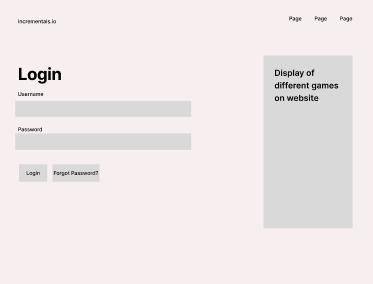
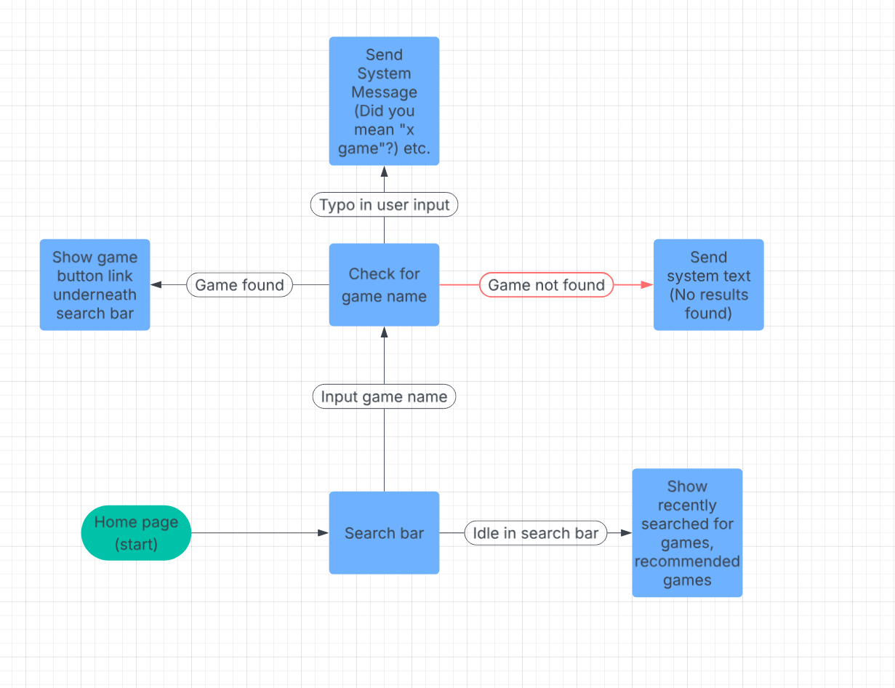
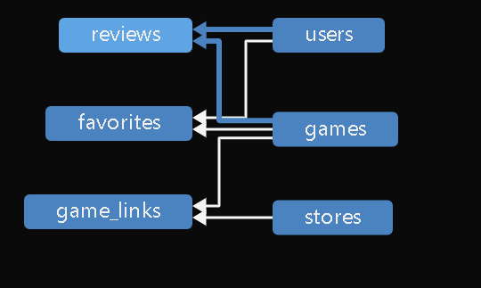
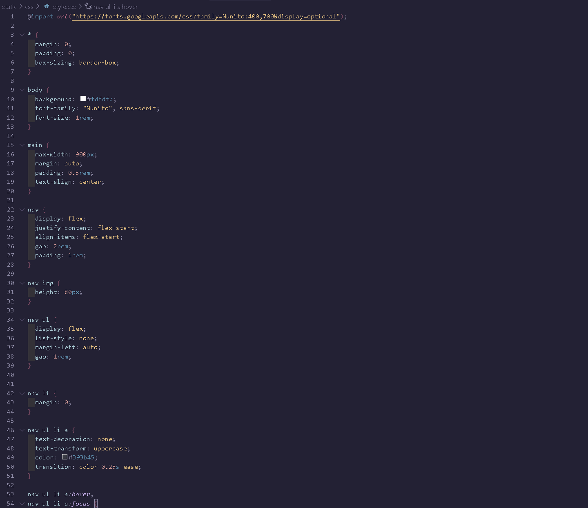
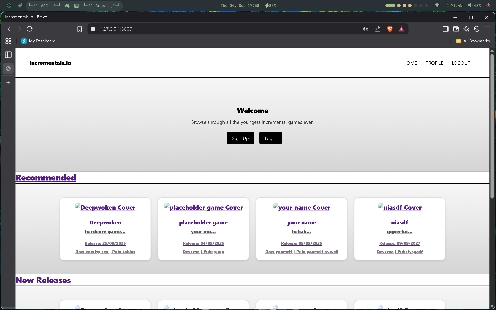
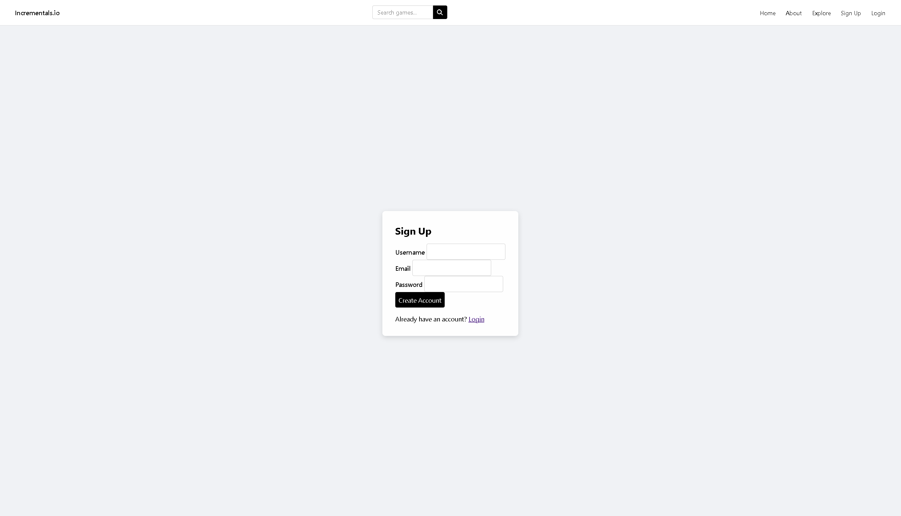
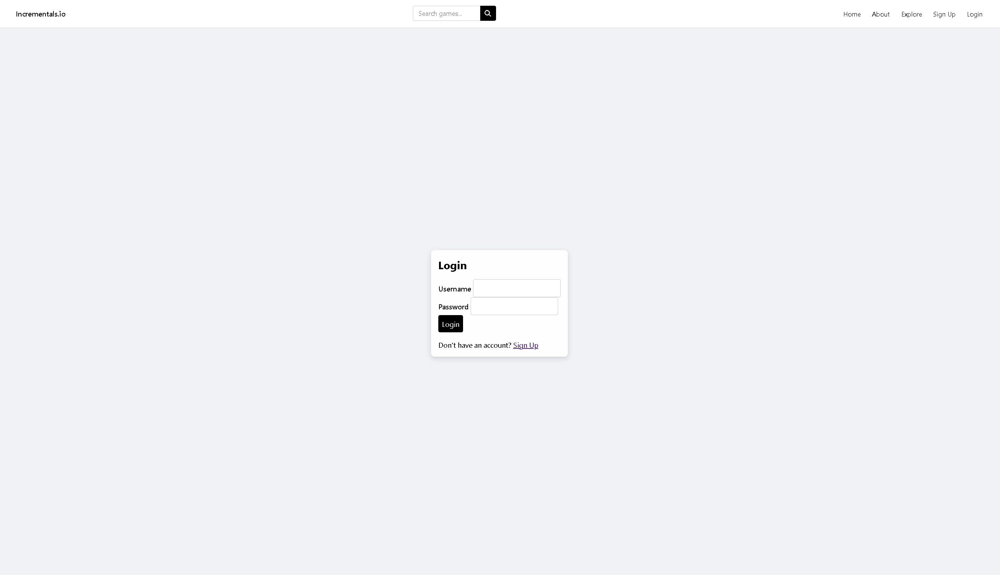
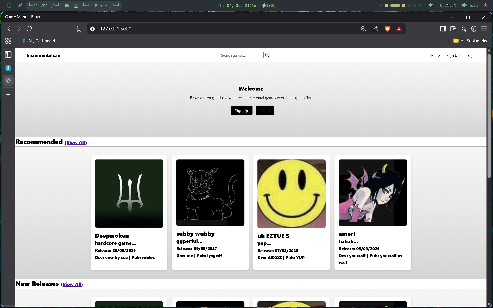
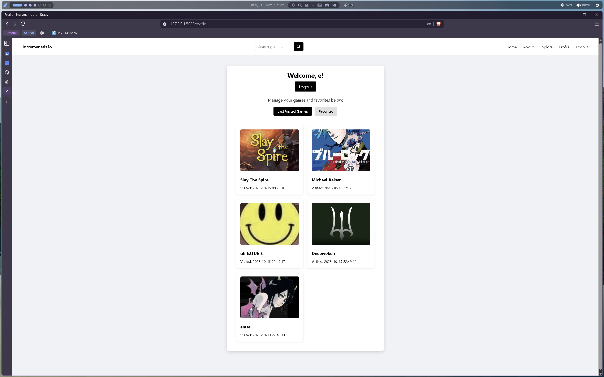
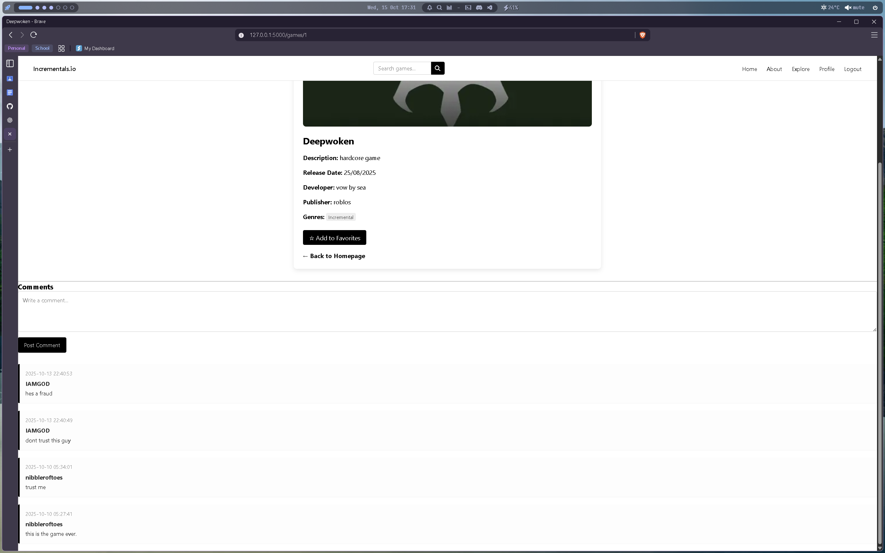

<!-- starting on incremental game search website -->
<!-- changed idea from chatbot (no chatbot code so unable to produce) -->
<!-- planning start - -->
<!-- search function -->
<!-- redirect function -->
<!-- add game function -->

<h1>Documentation </h1>

<h3>Incremental website </h3>
<h6>Allows for browsing, searching & adding incremental games</h6> 
Similarly to websites like Galaxy.click and Steam, I aim for my website to display the following: 

- Search and filter games by genre, platform, and release date. 

- Compare availability across different online stores and platforms. 

- Read and share community reviews, ratings, and recommendations. 

- Save and track favorite games for quick access. 

<h1><b>Week 1: Functional and Non-functional requirements</b></h1> 
<pre><b>Requirement</b>                                                       | <b>Type</b>           | 
 ---------------------------------------------------------------- | -------------- | 
 Users can browse a catalog of incremental games.                 | Functional     | 
 Users can search games by name, tags, or genre.                  | Functional     | 
 Users can filter games (e.g., sci-fi, idle, prestige mechanics). | Functional     | 
 Display trending, new, and most-played games.                    | Functional     | 
 Users can play games directly in the browser.                    | Functional     | 
 Users can switch to fullscreen mode.                             | Functional     | 
 Save progress locally for guests (local storage).                | Functional     | 
 Save progress in database for logged-in users.                   | Functional     | 
 Users can sign up, log in, and log out.                          | Functional     | 
 Profiles include saved games, favorites, play history.           | Functional     | 
 Users can rate and review games.                                 | Functional     | 
 Users can comment/discuss games.                                 | Functional     | 
 System can recommend games based on play history.                | Functional     | 
 Notifications for new games (optional).                          | Functional     | 
 Guest play supported without account.                            | Functional     | 
 Page load time under 3 seconds.                                  | Non-Functional | 
 Games load within 5 seconds on average.                          | Non-Functional | 
 System supports multiple concurrent users.                       | Non-Functional | 
 Auto-save game progress (local + cloud).                         | Non-Functional | 
 Backup and restore of database.                                  | Non-Functional | 
 Intuitive, simple interface with minimal clicks.                 | Non-Functional | 
 Passwords stored with hashing (e.g., bcrypt).                    | Non-Functional | 
 </pre>
<h1><b>Week 2: Website Design</b></h1> 

<h1><b>Week 3: Alternate Website Design</b></h1> 

 Continued on Figma prototype, adding different colours (black and white), typography, a signup/login page and search function.  

<h1><b>Week 4: Website Algorithms</b></h1> 

 Designing Algorithms: 
 Created 2 Algorithms-
 
1. Login Page 
Test case - Valid login credentials 
Verify that the user can successfully log in with valid credentials. 
Preconditions: The user has created an account and has a valid username and password. 
Steps:
1. Open the login page.
2. Enter the valid username and password in the username field.
3. Click the login button.
Expected Result: The user is successfully logged in and redirected to the homepage.

 

2. Search Function 
Test Case- Search function 
Verify that the search bar returns relevant results for a valid search query. 
Preconditions: The search function is enabled and the search database includes relevant data. 
Steps:
1. Open the search bar.
2. Enter a valid search query (e.g. "incremental game").
3. Click the search button or press Enter.
Expected Result: The search results page displays a list of relevant incremental games, including titles, descriptions, and other relevant information.

 

<h1><b>Week 5 & 6: SQL Setup</b></h1> 
<h3>Queries</h3> 
1. Logininformation to gameinformation 
   dblogin username > game history (game name), last login > game visit date 
2. Favourites table > Login Data 
   Use login data to add favourites to user data, displaying favourites in specific area. 
3. Genres table > gameinformation 
   Display game genre (with link to other games of game genre) under game information. 
4. Reviews table > gameinformation 
   Display review data for specific game underneath gameinformation 
5. Sessions table > Login Data 
   Sessions table ensures the user can stay logged in if they close or refresh the browser using their ip address. 
6. Gamelinks table > Stores
   Allows user to click on link to be redirect to a store where user can view or buy game (if game is paid).

 
^shows all links between each table^

<h1><b>Week 7 & 8: Website styling/development</b></h1> 
<h3>Creating CSS & Html Files</h3> 
Followed through the provided template and creates a styles.css file to put provided styles in. Changed the code around a tiny bit to fit my planned Figma colour scheme.

 

Created a Home, Signup & login page. These all successfully link to their respective table databases.\

 
^image of homepage^
 
^image of signup page^
 
^image of login page^

<h1><b>Week 9 & 10: Adding Interactivity</b></h1> 
Multiple different interactive features have been added to the webapp, such as game thumbnails, an about & explore section, a profile section with recently visited and favourited games, a search bar to search for games and a tag based filter for games.

 
^the revised home page with all added features^
 
^profiles page with most recently visited and favourite games^
<h1><b>Holidays:</b></h1> 
Added a Comments section for users to write reviews on the games. 

 

<h1>How to run webapp:</h1> 
Open VSCode and open Terminal with Ctrl + ` 
Run the following command:  
python3 main.py 
The website should now be running on 127.0.0.1:5000