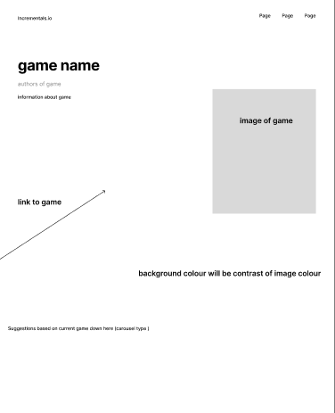
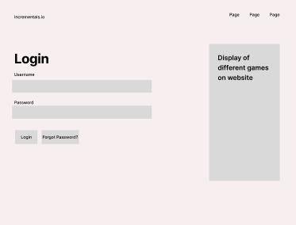
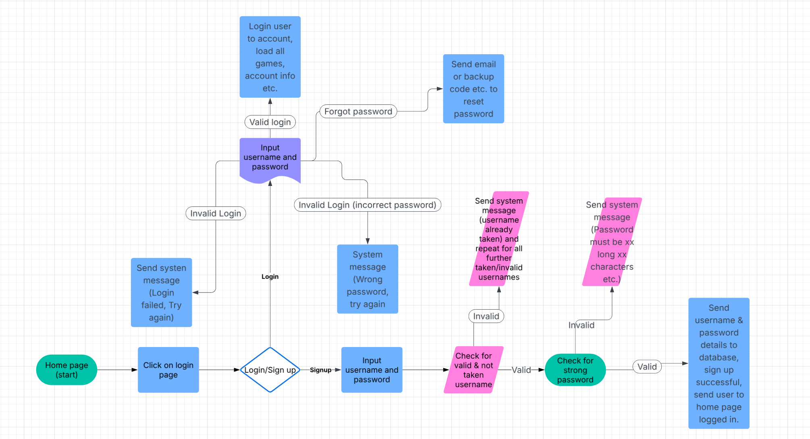
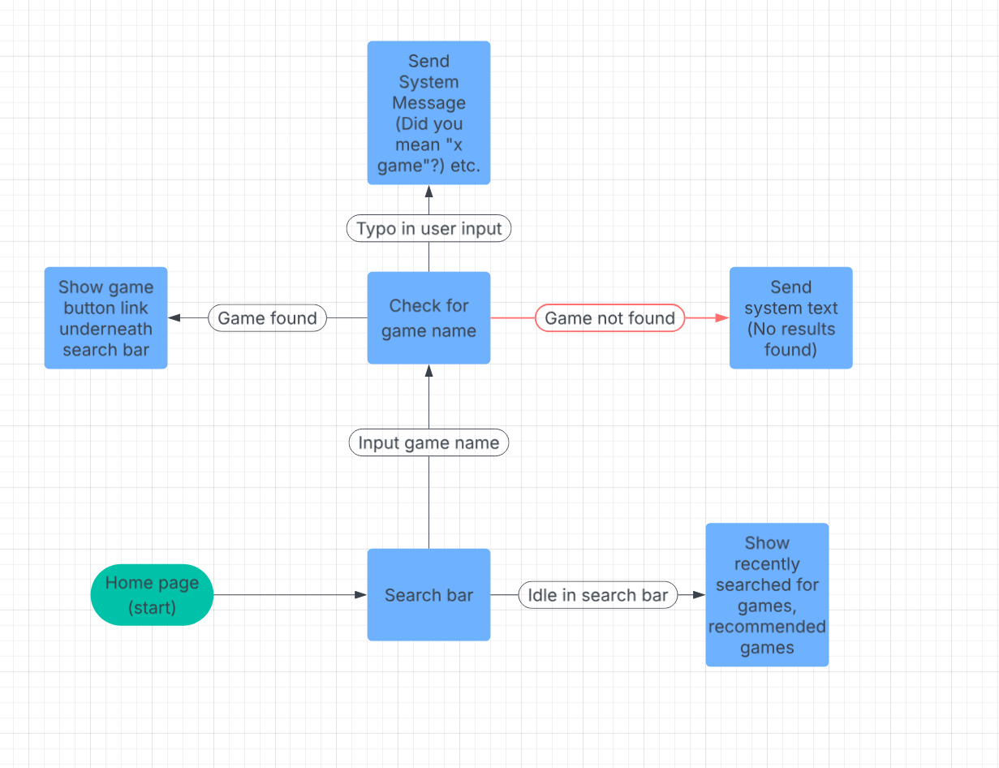

<!-- starting on incremental game search website -->
<!-- changed idea from chatbot (no chatbot code so unable to produce) -->
<!-- planning start - -->
<!-- search function -->
<!-- redirect function -->
<!-- add game function -->

<h1>Documentation </h1>

- Started planning 

<h3>Incremental website </h3>
<h6>Allows for browsing, searching & adding incremental games</h6> 

Functional Requirements:  

Non-Functional Requirements:  

 Alternate Website Design 

 Continued on Figma prototype, adding different colours (black and white), typography, a signup/login page and search function.  

 Designing Algorithms: 
 Created 2 Algorithms-
 
1. Login Page 
Test case - Valid login credentials
Verify that the user can successfully log in with valid credentials.
Preconditions: The user has created an account and has a valid username and password.
Steps:
1. Open the login page.
2. Enter the valid username and password in the username field.
3. Click the login button.
Expected Result: The user is successfully logged in and redirected to the homepage.

 

2. Search Function 
Test Case- Search function
Verify that the search bar returns relevant results for a valid search query.
Preconditions: The search function is enabled and the search database includes relevant data.
Steps:
1. Open the search bar.
2. Enter a valid search query (e.g. "incremental game").
3. Click the search button or press Enter.
Expected Result: The search results page displays a list of relevant incremental games, including titles, descriptions, and other relevant information.

 

