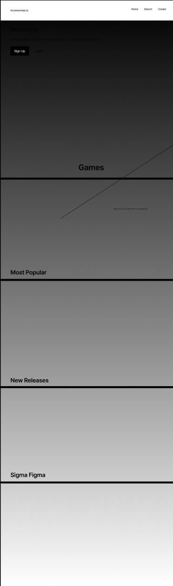

<!-- starting on incremental game search website -->
<!-- changed idea from chatbot (no chatbot code so unable to produce) -->
<!-- planning start - -->
<!-- search function -->
<!-- redirect function -->
<!-- add game function -->

<h1>Documentation </h1>

- Started planning 

<h3>Incremental website </h3>
<h6>Allows for browsing, searching & adding incremental games</h6> 

<h1>**Functional and Non-functional requirements**</h1>
 **Requirement**                                                  | **Type**       |
 ---------------------------------------------------------------- | -------------- |
 Users can browse a catalog of incremental games.                 | Functional     |
 Users can search games by name, tags, or genre.                  | Functional     |
 Users can filter games (e.g., sci-fi, idle, prestige mechanics). | Functional     |
 Display trending, new, and most-played games.                    | Functional     |
 Users can play games directly in the browser.                    | Functional     |
 Users can switch to fullscreen mode.                             | Functional     |
 Save progress locally for guests (local storage).                | Functional     |
 Save progress in the cloud for logged-in users.                  | Functional     |
 Users can sign up, log in, and log out.                          | Functional     |
 Profiles include saved games, favorites, play history.           | Functional     |
 Users can rate and review games.                                 | Functional     |
 Users can comment/discuss games.                                 | Functional     |
 System can recommend games based on play history.                | Functional     |
 Admins can add, edit, or remove games.                           | Functional     |
 Admins can manage tags/genres.                                   | Functional     |
 Admins can moderate user reviews and comments.                   | Functional     |
 Admins have analytics dashboard (engagement, most played).       | Functional     |
 Notifications for new games (optional).                          | Functional     |
 Guest play supported without account.                            | Functional     |
 Page load time under 3 seconds.                                  | Non-Functional |
 Games load within 5 seconds on average.                          | Non-Functional |
 System supports multiple concurrent users.                       | Non-Functional |
 Auto-save game progress (local + cloud).                         | Non-Functional |
 Backup and restore of database.                                  | Non-Functional |
 Intuitive, simple interface with minimal clicks.                 | Non-Functional |
 Encrypted connections via HTTPS.                                 | Non-Functional |
 Passwords stored with hashing (e.g., bcrypt).                    | Non-Functional |
 Protection against XSS, CSRF, SQL injection.                     | Non-Functional |
 Content moderation for user input.                               | Non-Functional |
 Modular codebase (easy to add new games).                        | Non-Functional |
 Clear developer/admin documentation.                             | Non-Functional |        
 Works on Chrome, Firefox, Safari, Edge.                          | Non-Functional |

 Alternate Website Design 

 Continued on Figma prototype, adding different colours (black and white), typography, a signup/login page and search function.  

 Designing Algorithms: 
 Created 2 Algorithms-
 
1. Login Page 
Test case - Valid login credentials 
Verify that the user can successfully log in with valid credentials. 
Preconditions: The user has created an account and has a valid username and password. 
Steps:
1. Open the login page.
2. Enter the valid username and password in the username field.
3. Click the login button.
Expected Result: The user is successfully logged in and redirected to the homepage.

 

2. Search Function 
Test Case- Search function 
Verify that the search bar returns relevant results for a valid search query. 
Preconditions: The search function is enabled and the search database includes relevant data. 
Steps:
1. Open the search bar.
2. Enter a valid search query (e.g. "incremental game").
3. Click the search button or press Enter.
Expected Result: The search results page displays a list of relevant incremental games, including titles, descriptions, and other relevant information.

 

